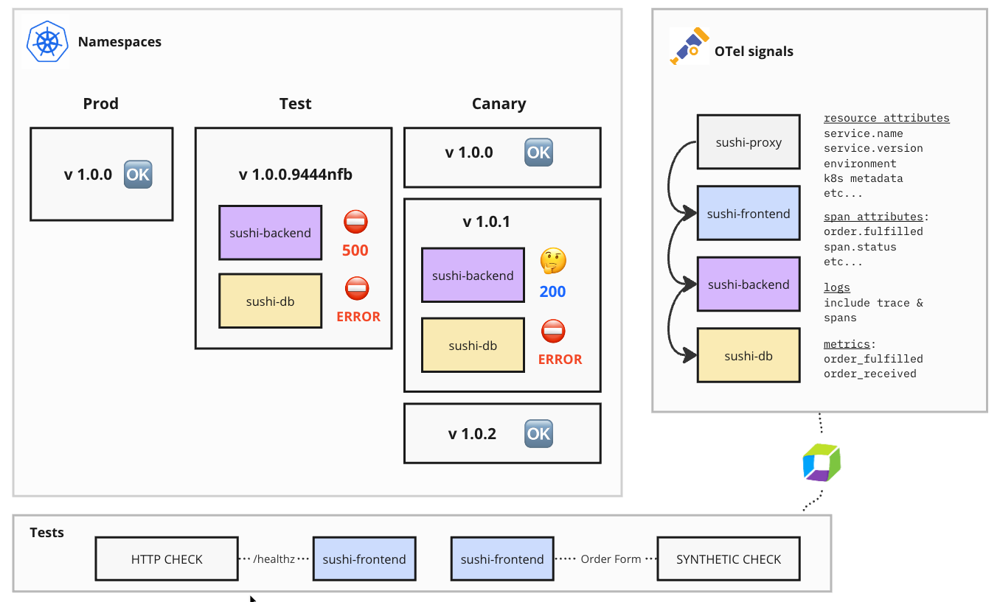
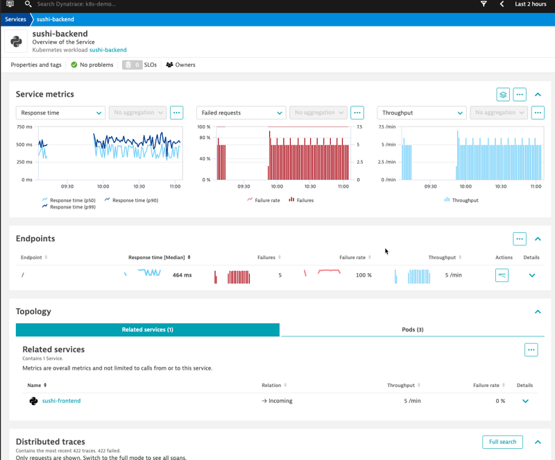
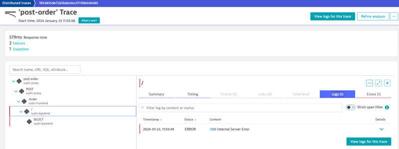
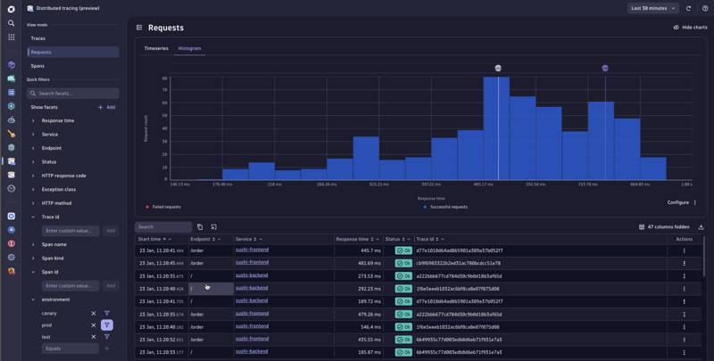
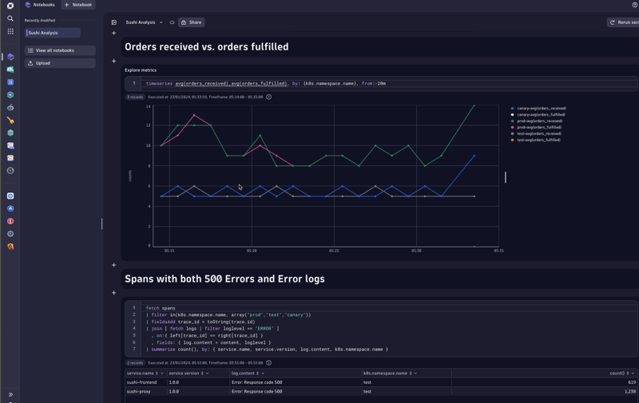
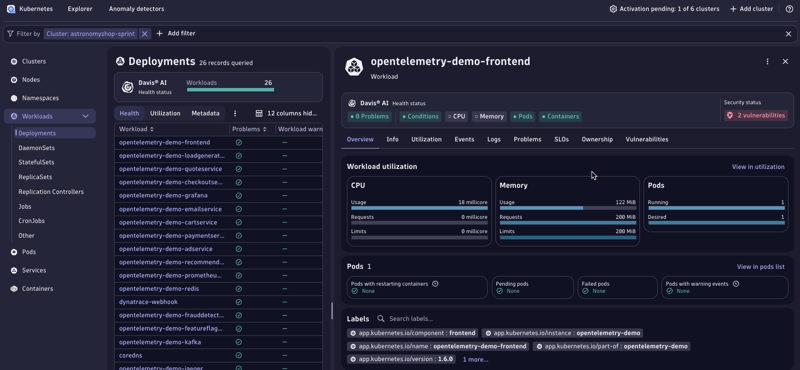
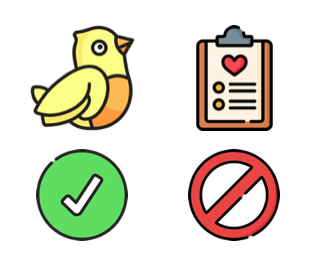

# Sushi

Shows end-to-end observability using Dynatrace and OpenTelemetry 

## Table of Contents

[About the demo](#About-the-demo)
[Quick tour](#quick-tour)
[Scenario 1](#Scenario-1)

## About the demo

This demo illustrates how valuable Dynatrace is for analyzing OpenTelemetry Traces, Metrics, and Logs. It begins with a quick tour of the product, starting with some familiar classic screens, and ending with new experiences like Distributed Tracing, Notebooks, and Kubernetes.

After the tour, the demo will focus on the importance of OpenTelemetry for monitoring Kubernetes workloads, as well as CI/CD pipelines, and present some interesting scenarios borrowed from the [OpenTelemetry Perform Breakout session with Northwestern Mutual Life](https://www.dynatrace.com/perform/agenda/?region=NORAM&type=LIVE&session=embrace-open-source-observability-with-end-to-end-visibility-into-opentelemetry).

For reference purposes we will be demonstrating a little application that requests and fulfills sushi orders. This will make more sense after the product tour, and might be useful as a reference.



### Quick tour

Before we get into the demo, we can take a quick tour of how Dynatrace provides OpenTelemetry signals in context, with a sneak-peak of the both the Kubernetes and Trace Intelligence exprience. Make sure to begin with familiar classic screens and end with the latest-greatest so you finish with a bang.

Start with the Unified Services screen for the [sushi-frontend in the test namespace](https://inx16596.sprint.apps.dynatracelabs.com/ui/apps/dynatrace.classic.services/ui/entity/SERVICE-823D5726CA1D674A). As you can see in the architecture image, this one is always throwing 500's. Emphasize the following:

- Everything in context (metrics, traces, logs, events)
- Horizontal topology
- Related pods
- Traces with OpenTelemetry information



Click on a trace to see more information about it and click the trace id to go to a classic trace screen. Mention that this is exactly the same experience no matter if you're using OpenTelemetry or OneAgent.

Show that the trace includes the OpenTelemetry error and logs.



Now it's time to look at some new things! We'll start with the new Distributed Tracing Experience. The number of traces is overwhelming so we will limit what we're looking at by using facets to view our Sushi application. An easy way to do that is to Add "environment" as a facet and filter on "prod", "test", and "canary" - mention that these are resource attributes on all of our OpenTelemetry spans.



Stay in the Distributed Tracing experience and adjust the facets to show more information about different environments and namespaces. The "test" namespace has errors. Selecting all of the namespaces, and choosing different services will show the distribution of response times between these services. Choosing the db.name facet, and filtering on the database "sushi" (span view) will show response times of database calls. Remind the viewer that all of this is 100% OpenTelemetry information. There are no agents in this Kubernetes cluster.

Next we can go to the [Sushi Notebook page](https://inx16596.sprint.apps.dynatracelabs.com/ui/apps/dynatrace.notebooks/notebook/61a57859-c478-4f08-805e-96b4a20a6ec5) to further illustrate how we can ask questions about metrics, logs, and spans to do deeper analysis. Explain that DQL is an easy language, and that these queries should be easy to interpret, but also mention that we're building a CoPilot experience to translate English queries into DQL.



Go through each query emphasizing the simplicity of the syntax. Write a new query to show how it's done.

```
fetch spans
| filter db.name != ""
| filter service.name == "sushi-backend"
| filter startsWith(db.statement, "select")
| summarize count(), alias: cnt, by: {db.statement}
| sort cnt desc

```

Lastly we can look at the Kubernetes application. At this time the Sushi app will not appear in the application, but the OpenTelemetry demo is also installed on this cluster. Filter by the astronomy-sprint cluster and show how OpenTelemetry attributes appear for each workload. Explain that there are no OneAgents in this cluster.



### Demo time!

Now that you've illustrated the power of using Dynatrace for OpenTelemetry analysis, it's time to tell a story. It's the same story presented during the Perform session with Northwestern Mutual Life, who uses OpenTelemetry to send information from their Gitlab pipeline about the success, or failure, of canary deployments. It's a nice end-to-end example of how critical Dynatrace is when shifting left to improve quality via continuous integration and deployments.

The demo is broken up into four different scenarios. All of this information is sent to Dynatrace via a CI/CD Github Workflow instrumented with OpenTelemetry. We'll look at the traces in Dynatrace and explore how our CI/CD pipeline improved over time.

| Scenario    | Backend      | Test         | Namespace    |  Take-away                                                                                 |
|-------------| -------------| -----------  | -------------|--------------------------------------------------------------------------------------------|
| 1           | 1.0.0        | HTTP Check   | Canary       | HTTP checks are inadquate for catching problems. Fortunately, this version is problem free.|
| 2           | 1.0.1        | HTTP Check   | Canary       | Now we see the problem with HTTP checks. There are 200s, but DB errors and failed orders   |
| 3           | 1.0.1        | Synthetic    | Canary       | Success. We catch the problem. Even though there are 200s the canary test fails            |
| 4           | 1.0.2        | Synthetic    | Canary       | Now we're back to a normal state. No failures, and much better test coverage               |

### Scenario 1

#### Triggering the pipeline

- Browse https://deploy.sushi0.cc and explain that this page triggers a CI/CD pipeline on Github
- Explain that the **Deploy** button pushed 1.0.0 of the application and trigger some tests
- No need to deploy anything - since that takes time - the results are what matters
- Don't click "reveal scenari0" until after the analysis.



#### Analysis

Before we get into the analysis we'll take a quick tour.

#### Quick tour

Make sure to begin with familiar classic screens and end with the latest-greatest.

Start with the Unified Services screen for the [sushi-frontend in the test namespace](https://inx16596.sprint.apps.dynatracelabs.com/ui/apps/dynatrace.classic.services/ui/entity/SERVICE-823D5726CA1D674A). As you can see in the architecture image, this one is always throwing 500's. Emphasize the following:

- Everything in context (metrics, traces, logs, events)
- Horizontal topology
- Related pods
- Traces with OpenTelemetry information


Click on a trace to see more information about it and click the trace id to go to a classic trace screen. Mention that this is exactly the same experience no matter if you're using OpenTelemetry or OneAgent.

Show that the trace includes the OpenTelemetry error and logs.


Begin by going to the new [Distributed Tracing view](https://inx16596.sprint.apps.dynatracelabs.com/ui/apps/dynatrace.distributedtracing) and taking a brief tour of the sushi application. Add the Open Telemetry resource attribute Environment to the list of facets, and narrow down the environments to PROD, TEST, and CANARY. The Histogram will show a nice distribution of the response times and failures.


## Setup

Fork this repo.

Create the following Github secrets.

```
DOCKER_USERNAME: Your Docker Hub username
DOCKER_PASSWORD: Your Docker Hub token or password
GCP_PROJECT_ID: The ID of your Google Cloud Platform project
GCP_SA_KEY: The JSON key for your GCP Service Account
GKE_CLUSTER_NAME: The Google cluster
GKE_CLUSTER_ZONE: The Availablity Zone of the cluster
FIRST_MONITOR_ID: The ID of a simple HTTP monitor (script below)
MONITOR_ID: The ID of a better synthetic monitor (script below)
DYNATRACE_ENDPOINT: The endpoint URL for your Dynatrace server
DYNATRACE_TOKEN: The API token for Dynatrace. Requires events.ingest,openTelemetryTrace.ingest, syntheticExecutions.read, syntheticExecutions.write
```

The first synthetic monitor script should look like this (replace the URL or IP)

```
{
	"version": "1.0",
	"requests": [
		{
			"description": "sushi0.cc/healthz",
			"url": "https://sushi0.cc/healthz",
			"method": "GET",
			"validation": {
				"rules": [
					{
						"type": "httpStatusesList",
						"value": ">=400",
						"passIfFound": false
					}
				]
			},
			"configuration": {
				"acceptAnyCertificate": true,
				"followRedirects": true,
				"shouldNotPersistSensitiveData": false
			}
		}
	]
}
```

The better synthetic monitor script should look like this (replace the URL or IP)

```
{
    "configuration": {
        "chromiumStartupFlags": {
            "disable-web-security": false
        },
        "device": {
            "orientation": "landscape",
            "deviceName": "Desktop"
        }
    },
    "type": "clickpath",
    "version": "1.0",
    "events": [{
        "type": "navigate",
        "authentication": {
            "type": "http_authentication",
            "credential": {
                "id": "CREDENTIALS_VAULT-0991E887F05B660C"
            }
        },
        "wait": {
            "waitFor": "page_complete"
        },
        "description": "Start",
        "url": "https://sushi0.cc"
    }, {
        "type": "click",
        "wait": {
            "waitFor": "page_complete"
        },
        "target": {
            "locators": [{
                "type": "css",
                "value": "button[type=\"submit\"]"
            }, {
                "type": "css",
                "value": "button:contains(\"Place Order\")"
            }, {
                "type": "css",
                "value": "html body:nth-child(2) div form button"
            }, {
                "type": "css",
                "value": "body div.container form button"
            }]
        },
        "button": 0,
        "description": "click on \"Place Order\""
    }, {
        "type": "click",
        "target": {
            "locators": [{
                "type": "css",
                "value": "#yes"
            }]
        },
        "button": 0,
        "description": "Click Order"
    }]
}
```


